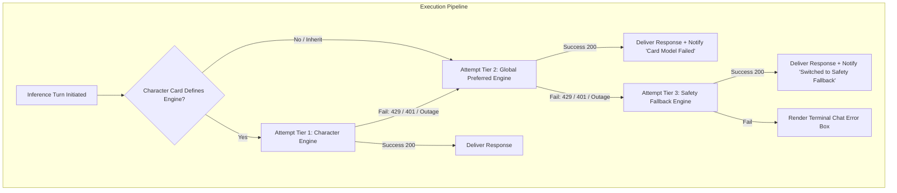
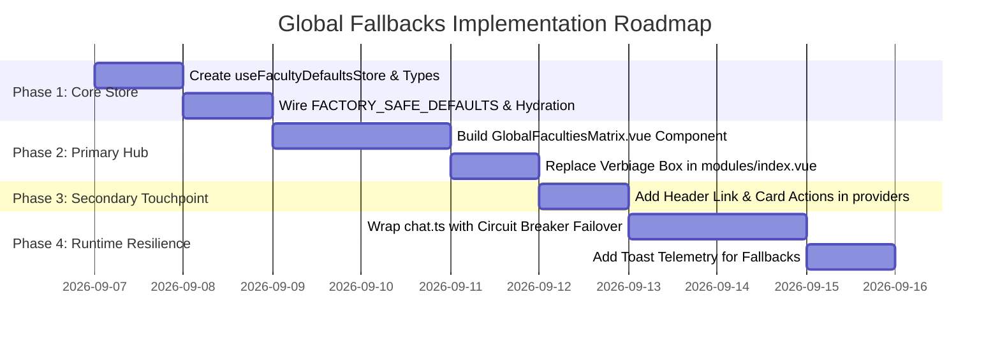

# Design Specification: Global Fallbacks & Default Faculties System

**Status:** Proposed Architecture & Design Specification
**Target Subsystems:**
- `packages/stage-pages/src/pages/settings/modules/index.vue` (Primary Hub: replaces passive explainer callout with interactive Global Faculties Matrix)
- `packages/stage-pages/src/pages/settings/providers/index.vue` (Secondary Touchpoint: quick action & default badge per provider)
- `packages/stage-ui/src/stores/faculty-defaults.ts` (New: Unified Faculty Defaults & Fallback Management Store)
- `packages/stage-ui/src/stores/modules/` (`consciousness.ts`, `speech.ts`, `hearing.ts`, `vision.ts`, `artistry.ts`)
- `packages/stage-ui/src/stores/chat.ts` (Runtime circuit-breaker failover routing)

**Authoritative References:**
- [`.agents/skills/airi-provider-core-registry/`](../.agents/skills/airi-provider-core-registry/SKILL.md) — Provider definition, metadata, and local model cache contracts.
- [`.agents/skills/airi-onboarding-v2/`](../.agents/skills/airi-onboarding-v2/SKILL.md) — First-run onboarding flow and store initialization.
- [`.agents/skills/airi-artistry-comfyui-widgets/`](../.agents/skills/airi-artistry-comfyui-widgets/SKILL.md) — Artistry bridge and provider routing.
- [`docs/data-catalog.md`](./data-catalog.md) — Canonical persisted storage keys and settings catalog.
- [`docs/rosetta-stone.md`](./rosetta-stone.md) — §6 Providers and §7 Module System.

---

## 1. Executive Summary & Problem Diagnosis

### 1.1 The Lost "Out-of-the-Box" Experience
AIRI's modular architecture grew to support multi-instance providers, card portability (`extensions.airi.*`), multiple windows (Electron, Web, Pocket), and granular settings. However, this flexibility led to configuration fragmentation across three separate layers:

```
Tier 1: Character Card (`extensions.airi.*`)   → Highest precedence (portable soul)
Tier 2: Standalone Modules (`settings/*`)      → Fragmented per-domain settings
Tier 3: Provider Catalog (`local:providers`)   → Raw API keys & local model caches
```

Because there is currently **no unified fallback registry**, fresh installs or unconfigured characters hit dead ends:
- **Consciousness (LLM)** defaults to `''` (empty string) → chat crashes immediately with `⚠️ Chat Generation Failed: AIRI Chat Provider not initialized`.
- **Speech (TTS)** defaults to `'speech-noop'` → companion is completely silent.
- **Hearing (STT)** defaults to `''` (empty string) → microphone transcription does nothing.
- **Artistry** defaults to `'comfyui'` querying `http://localhost:8188` → fails on all standard client machines without a local Python/CUDA server running.
- **Vision** defaults to `''` (empty string) → image analysis fails.

### 1.2 The "Three-Screen Scramble" & Passive Verbiage
When an AI turn fails, users are forced into a confusing troubleshooting loop:
1. Hunt through `Settings > Inference Providers` to enter API keys or check models.
2. Jump to `Settings > Modules` to find where the active engine is picked.
3. Check `Settings > AIRI Card Editor` or the top-right Brain Picker to ensure the character isn't overriding the system with a non-existent provider.

In `Settings > Modules`, an explainer card titled **"HOW MODULES WORK WITH CHARACTERS"** currently consumes vertical space to describe this complexity to the user in text:
> *"1. Inference Providers: Configure raw API keys... 2. Modules (Here): Test, tune parameters in isolated playgrounds. 3. Character Cards: Assign specific providers..."*

Rather than explaining the confusion with static text, **this space should actively solve the problem** by hosting the interactive **Global Faculties & Fallback Matrix**.

---

## 2. Empirical Model Landscape: High-Fidelity Local Heroes & Zero-Config Cloud

A robust fallback system requires realistic defaults that deliver delightful functionality out of the box without requiring credit cards, sign-ups, or unprompted multi-gigabyte downloads.

### 2.1 Mind (LLM): Xiaomi MiMo (`mimo-auto`) + WebLLM
- **Code Reality**: Xiaomi MiMo is already fully implemented in [`packages/stage-ui/src/libs/providers/providers/mimo/index.ts`](file:///Users/richardpinedo/Projects.nosync/airi/airi_dasilva333/packages/stage-ui/src/libs/providers/providers/mimo/index.ts).
- **Mechanism**: Generates an anonymous device fingerprint (`mimo_fingerprint`), queries `https://api.xiaomimimo.com/api/free-ai/openai/chat`, and requires **zero API key and zero sign-up**.
- **Role**: Primary zero-config cloud fallback. For offline capability on WebGPU-enabled machines, the system pairs with **WebLLM** / **RWKV**.

### 2.2 Artistry (Image Gen): Pollinations AI (`pollinations`) with Free Auto Router
- **Code Reality**: Fully implemented in the desktop main process ([`artistry-bridge.ts`](file:///Users/richardpinedo/Projects.nosync/airi/airi_dasilva333/apps/stage-tamagotchi/src/main/services/airi/widgets/artistry-bridge.ts), [`providers/pollinations.ts`](file:///Users/richardpinedo/Projects.nosync/airi/airi_dasilva333/apps/stage-tamagotchi/src/main/services/airi/widgets/providers/pollinations.ts)) and renderer ([`artistry.vue`](file:///Users/richardpinedo/Projects.nosync/airi/airi_dasilva333/packages/stage-pages/src/pages/settings/modules/artistry.vue)).
- **Mechanism**: Inspecting `providers/pollinations.ts:71`:
  `const modelParam = model ? `&model=${encodeURIComponent(model)}` : ''`
  When `model = ""` (empty string), Pollinations omits the model parameter and routes directly to the **Free Auto Router** on their unauthenticated public cluster without requiring a Pollen API key or registration. (Passing a specific model like `flux` routes to their metered Pollen tier).
- **Role**: Replaces `comfyui` as the default Artistry engine with `model: ""` (`Free Auto Router`). New users generate journal polaroids, selfies, and background art instantly without installing local Python CUDA rigs.

### 2.3 Speech (TTS): Kokoro WebGPU (82MB) + Web Speech API
- **Code Reality**: Kokoro WebGPU worker is in [`packages/stage-ui/src/workers/kokoro/`](file:///Users/richardpinedo/Projects.nosync/airi/airi_dasilva333/packages/stage-ui/src/workers/kokoro/) and Web Speech API is in [`packages/stage-ui/src/libs/providers/providers/web-speech-api/`](file:///Users/richardpinedo/Projects.nosync/airi/airi_dasilva333/packages/stage-ui/src/libs/providers/providers/web-speech-api/).
- **Model Size Reality**: At **82 MB**, Kokoro ONNX is lightweight on modern broadband/fiber and produces natural, emotionally expressive TTS. We avoid downgrading users to robotic browser voices by default.
- **Role**:
  - **Primary Local Default**: **Kokoro WebGPU** (82MB one-time cache into CacheStorage).
  - **Zero-Download Fail-Safe**: **Web Speech API** (built into Chromium/Electron; zero megabytes).

### 2.4 Hearing (STT): Whisper-Local Tiny (~39MB) + Web Speech API
- **Code Reality**: Whisper worker is in [`packages/stage-ui/src/libs/workers/whisper/`](file:///Users/richardpinedo/Projects.nosync/airi/airi_dasilva333/packages/stage-ui/src/libs/workers/whisper/).
- **Role**:
  - **Primary Local Default**: **Whisper Tiny** (~39MB download).
  - **Instant Zero-Download Fail-Safe**: **Web Speech API**.

### 2.5 Vision (Perception): SmilingWolf WD14 Tagger + Cloud VLM
- **Code Reality**: In [`packages/stage-ui/src/workers/blip/worker.ts`](file:///Users/richardpinedo/Projects.nosync/airi/airi_dasilva333/packages/stage-ui/src/workers/blip/worker.ts), the worker historically named `blip` actually loads the **SmilingWolf WD14 SwinV2/ConvNeXt tagger** (`SmilingWolf/wd-swinv2-tagger-v3` / `wd-v1-4-swinv2-tagger-v2`).
- **Role**:
  - **Local Tagging**: WD14 SwinV2 (~300MB–450MB) for Danbooru/anime visual element analysis.
  - **Cloud VLM**: When an OpenAI, Gemini, or OpenRouter key is present, vision forwards multimodal turns to the cloud VLM.

---

## 3. The Invariant Matrix & 3-Tier Double Failover Architecture

### 3.1 The Faculty Invariant Matrix
Not all AI faculties operate at the same scope. AIRI enforces a strict separation between **Card-Bound Faculties** (which travel with a companion card) and **System-Bound Faculties** (which belong to the client device/user):

| Faculty Domain | Card Slot in Card Editor? | Architectural Scope | Failover Tiers |
| :--- | :--- | :--- | :--- |
| **Mind (Consciousness)** | **YES** (`modules.consciousness`) | Persona soul | 3-Tier: Card $\rightarrow$ Global $\rightarrow$ Fallback |
| **Speech (TTS)** | **YES** (`modules.speech`) | Persona voice | 3-Tier: Card $\rightarrow$ Global $\rightarrow$ Fallback |
| **Artistry (Image Gen)** | **YES** (`artistry`) | Character aesthetics & prompt prefix | 3-Tier: Card $\rightarrow$ Global $\rightarrow$ Fallback |
| **Hearing (STT)** | **NO** (Client mic hardware) | User audio input | 2-Tier: Global $\rightarrow$ Fallback |
| **Vision (VLM / OCR)** | **NO** (Client screen sensor) | Desktop observation & salience | 2-Tier: Global $\rightarrow$ Fallback |

### 3.2 The 3-Tier Double Failover Chain
Rather than complex routing heuristics, the system uses a simple, predictable **3-Tier Double Failover**:



1. **Tier 1: Character Card Override** (`(Provider, Model)`):
   - Defined in the Character Card Editor (`modules` / `artistry` tabs).
   - If configured, AIRI attempts this engine first.
2. **Tier 2: Global Preferred Baseline** (`(Provider, Model)`):
   - Configured in `Settings > Modules` (e.g. `OpenRouter + Claude 3.5 Sonnet`, or `Kokoro + af_heart`).
   - If the card specifies `"None / Inherit"`, this is the primary engine.
   - If the card engine fails (HTTP 429 Quota, 401 Auth, Timeout), the system steps down to this Global Preferred.
3. **Tier 3: Safety Fallback Net** (`(Provider, Model)`):
   - Zero-sign-up, zero-friction safe engine (e.g. `MiMo + mimo-auto`, `Pollinations + Auto Router`, `Web Speech API`).
   - If Tier 2 fails, the system transparently steps down to Tier 3, ensuring the companion never dies.

---

## 4. UI/UX Surface Architecture

The fallback controls are integrated into two complementary locations:

### 4.1 Primary Hub: `Settings > Modules` (Option A)
The passive explainer box (`modules/index.vue:63-95`) is completely replaced by the **Global Faculties & Fallback Matrix**:

```
┌──────────────────────────────────────────────────────────────────────────────────────────────────┐
│ 🌐 SYSTEM FACULTIES & GLOBAL FALLBACKS                                    [ Reset to Factory Safe ]│
│ Configure default engines used when cards inherit settings or when a primary provider fails.     │
├──────────────┬──────────────┬──────────────┬──────────────────┬─────────────────┤
│ 🧠 Mind (LLM)│ 🗣️ Speech    │ 👂 Hearing   │ 🎨 Artistry      │ 👁️ Vision       │
├──────────────┼──────────────┼──────────────┼──────────────────┼─────────────────┤
│ Primary:     │ Primary:     │ Primary:     │ Primary:         │ Primary:        │
│ OpenRouter   │ Kokoro 82M   │ Whisper Tiny │ Pollinations     │ SmilingWolf WD14│
│ claude-3.5-s │ af_heart     │ en-tiny      │ (Auto Free)      │ v3-swinv2       │
│              │              │              │                  │                 │
│ Fallback:    │ Fallback:    │ Fallback:    │ Fallback:        │ Fallback:       │
│ MiMo (Free)  │ Web Speech   │ Web Speech   │ ComfyUI (Local)  │ None            │
│ mimo-auto    │ (browser)    │ (browser)    │                  │                 │
│              │              │              │                  │                 │
│ 🟢 Auto 429  │ 🟢 Auto 429  │ 🟢 Auto-fail │ 🟢 Auto-fail     │ ⚪ Manual       │
└──────────────┴──────────────┴──────────────┴──────────────────┴─────────────────┘
```

#### Dual-Pair `(Provider, Model)` Drawer with Playground Bridge & Speech 3-Tuple:
Clicking any faculty card expands the **Detailed Faculty Configuration Drawer**:
1. **Contextual Breadcrumb**:
   - Displays the active card's setting: *"Active Card (`<Companion Name>`): `None / nvidia` (Inheriting Global Preferred)"*.
2. **Dual Engine Pairs & Speech 3-Tuple Architecture**:
   - **All-Provider Visibility with Prioritized Sorting**: Instead of restricting fallback choices to only local/free engines, **all available providers** in the ecosystem are accessible in both Primary and Fallback selectors.
   - **Native `<optgroup>` Segmentation**:
     - `<optgroup label="Recommended Fallbacks (Free & Local)">`: Houses zero-sign-up / on-device baselines (MiMo, WebLLM, Kokoro, Whisper, Pollinations, ComfyUI, WD14).
     - `<optgroup label="All Available Providers">`: Lists all other user-configured cloud and local inference services.
   - **Speech 3-Tuple (`provider`, `model`, `voiceId`)**:
     - **Primary Speech** requires 3 components: Provider, Model, and Voice.
     - Default catch-all voice: `af_heart` (Heart · Warm Conversational Female).
     - Full integration with **Audio Studio Virtual Voice Profiles** (`docs/feat-audio-studio.md`) and the user's configured profile (`userProfileStore.voiceProfileId`).
   - **Streamlined Fallback Speech (Preventing 6-Dropdown Sprawl)**:
     - To prevent cognitive fatigue and layout sprawl (avoiding 3 Primary + 3 Fallback = 6 dropdowns), Speech Fallback is streamlined into a single 1-click **Safety Fallback Engine** selector:
       - `Web Speech API (Browser Voice · Instant Zero-Download Safety Net - Default)`
       - `Kokoro WebGPU af_heart (Local Warm Female Catch-All · 82MB)`
       - `Pocket-TTS anna (Local Multilingual CPU Catch-All · ~100MB)`
       - `Mute / Silent (speech-noop)`
       - `Custom Provider / Model / Voice...` (unfolds full manual override pair if desired).
     - Total Speech dropdowns: 4 instead of 6.
   - **Full Artistry Model Resolution (Playground-Driven)**:
     - **Pollinations AI**: Free Auto Router (`model: ""`), plus cached live models with token pricing (e.g. `FLUX.1 Schnell (0.002 pollen)`, `GPT Image 1.5 (0.000024 pollen)`, `Nano Banana Pro (0.00012 pollen)`, `Seedream 4.5`).
     - **Nano Banana**: Google AI Studio engines (`Nano Banana 2 - Gemini 3.1 Flash Image`, `Nano Banana Pro`, `Nano Banana`).
     - **Replicate**: Curated cloud presets with cost annotations (`flux-schnell ($1 / 333 imgs)`, `p-image`, `z-turbo`, `z-turbo-lora`).
     - **ComfyUI**: Dynamic list of uploaded local workflows annotated with exposed fields count (e.g. `Default Text2Img (3 exposed fields)`).
     - **None**: Explicitly disabled state.
3. **Failover Triggers Checklist**:
   - `[x]` HTTP 429: Rate Limit / Quota Exhaustion
   - `[x]` HTTP 401/403: Expired / Invalid API Key
   - `[x]` HTTP 500/503: Provider Outage
   - `[x]` Network Timeout (>15 seconds)
4. **Consolidated Drawer Footer**:
   - Left-aligned: `[ 🧪 Open Full <Faculty> Playground → ]` (navigates to `/settings/modules/<faculty>`).
   - Right-aligned: `[ Cancel ]` and `[ Apply to System ]`.
5. **[Reset to Factory Safe]**:
   - Instantly restores the zero-sign-up baseline across all 5 faculties.

### 4.2 Secondary Touchpoint: `Settings > Inference Providers` (Option B)
In `packages/stage-pages/src/pages/settings/providers/index.vue`:
1. **Header Link Badge**: Above the provider tabs, a compact chip indicates the active global defaults with a direct link:
   > `⚙️ Defaults: Mind (OpenRouter) • Speech (Kokoro) • Artistry (Pollinations) [Manage in Modules →]`
2. **Provider Card Actions**: On each provider card (e.g. MiMo, OpenRouter, Kokoro), a menu action allows users to:
   - `★ Set as Primary Default`
   - `🛡️ Set as Fallback Engine`

### 4.3 Elimination of Option C (`System Preferences`)
Placing provider fallback matrices in `System Preferences` was evaluated and rejected:
- It isolates AI faculty configuration away from the provider and module interfaces.
- Users would experience unnecessary navigation friction between three separate tabs.

---

## 5. Data Model & Persistence Contract

Following AIRI's Data Catalog conventions (`docs/data-catalog.md`), settings are stored in `localStorage` under the `settings/faculties/*` namespace:

```typescript
// File: packages/stage-ui/src/stores/faculty-defaults.ts

export interface FacultyConfig {
  primaryProvider: string
  primaryModel: string
  primaryVoiceId?: string
  fallbackProvider: string
  fallbackModel: string
  fallbackVoiceId?: string
  autoFailover: boolean
  failoverTriggers: ('auth' | 'quota' | 'server_error' | 'timeout')[]
  notificationStyle: 'toast' | 'badge' | 'silent'
  recoveryIntervalMinutes: number
}

export interface GlobalFacultyDefaultsState {
  consciousness: FacultyConfig
  speech: FacultyConfig
  hearing: FacultyConfig
  artistry: FacultyConfig
  vision: FacultyConfig
}

export const FACTORY_SAFE_DEFAULTS: GlobalFacultyDefaultsState = {
  consciousness: {
    primaryProvider: 'mimo',
    primaryModel: 'mimo-auto',
    fallbackProvider: 'web-llm',
    fallbackModel: '',
    autoFailover: true,
    failoverTriggers: ['auth', 'quota', 'server_error', 'timeout'],
    notificationStyle: 'toast',
    recoveryIntervalMinutes: 15,
  },
  speech: {
    primaryProvider: 'kokoro-local',
    primaryModel: 'onnx-community/Kokoro-82M-v1.0-ONNX',
    primaryVoiceId: 'af_heart',
    fallbackProvider: 'web-speech-api',
    fallbackModel: '',
    fallbackVoiceId: '',
    autoFailover: true,
    failoverTriggers: ['server_error', 'timeout'],
    notificationStyle: 'toast',
    recoveryIntervalMinutes: 15,
  },
  hearing: {
    primaryProvider: 'whisper-local',
    primaryModel: 'openai/whisper-tiny',
    fallbackProvider: 'web-speech-api',
    fallbackModel: '',
    autoFailover: true,
    failoverTriggers: ['server_error', 'timeout'],
  },
  artistry: {
    primaryProvider: 'pollinations',
    primaryModel: 'flux',
    fallbackProvider: 'comfyui',
    fallbackModel: '',
    autoFailover: true,
    failoverTriggers: ['server_error', 'timeout'],
  },
  vision: {
    primaryProvider: 'blip', // SmilingWolf WD14 tagger worker
    primaryModel: 'SmilingWolf/wd-swinv2-tagger-v3',
    fallbackProvider: '',
    fallbackModel: '',
    autoFailover: false,
    failoverTriggers: [],
  },
}
```

### 5.1 Backward Compatibility & Migration
Existing standalone module stores (`consciousness.ts`, `speech.ts`, `artistry.ts`) will:
1. Initialize by inspecting `settings/faculties/defaults`.
2. If absent, migrate from legacy keys (`settings/consciousness/active-provider`, etc.).
3. If legacy keys are empty, seamlessly hydrate from `FACTORY_SAFE_DEFAULTS`.

---

## 6. Implementation Phasing



### Phase 1: Core Store & Factory Baseline
- Implement `packages/stage-ui/src/stores/faculty-defaults.ts`.
- Wire `FACTORY_SAFE_DEFAULTS` with MiMo, Pollinations, Kokoro, Whisper, and WD14.
- Expose typed resolution helpers: `resolveConsciousness()`, `resolveSpeech()`, `resolveArtistry()`.

### Phase 2: Primary Hub in `Settings > Modules`
- Create `packages/stage-pages/src/pages/settings/modules/components/GlobalFacultiesMatrix.vue`.
- Mount it at the top of `packages/stage-pages/src/pages/settings/modules/index.vue`, removing lines 63–95.
- Connect dropdown selectors to available providers and models.

### Phase 3: Secondary Touchpoint in `Settings > Inference Providers`
- Add the compact defaults status banner at the top of `packages/stage-pages/src/pages/settings/providers/index.vue`.
- Add context-menu / card button to set any provider as primary or fallback.

### Phase 4: Runtime Circuit Breaker in `chat.ts`
- In `packages/stage-ui/src/stores/chat.ts`, catch 401/429/500/timeout errors from `llmStore.stream`.
- Check `autoFailover` on the consciousness faculty.
- If enabled, retry the stream using the configured `fallbackProvider` and emit a graceful UI notification.

---

## 7. Verification & Safety Criteria

1. **Clean Installation Sanity**:
   - Clearing `localStorage` and opening chat without entering API keys must successfully connect to MiMo (`mimo-auto`) and receive an LLM reply.
   - Triggering autonomous artistry or `image_journal` must successfully generate an image via Pollinations without requiring ComfyUI.
2. **Type Safety & Build Integrity**:
   - `pnpm -F @proj-airi/stage-ui typecheck`
   - `pnpm -F @proj-airi/stage-pages typecheck`
   - `pnpm -F @proj-airi/stage-tamagotchi build`
3. **Storage Hygiene**:
   - Check `docs/data-catalog.md` to ensure all new keys (`settings/faculties/*`) are documented.
4. **Git Status & Fork Safety**:
   - Inspect `git status` after changes to ensure only scoped files are modified.
